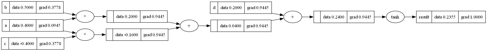

# simple-grad

A scalar-valued automatic differentiation engine and a tiny neural network library, built from scratch in pure Python as the first step toward training a handwritten digit classifier.

The project follows the ideas of Andrej Karpathy's [micrograd](https://github.com/karpathy/micrograd) and his lecture [*The spelled-out intro to neural networks and backpropagation*](https://www.youtube.com/watch?v=VMj-3S1tku0).



## Features

- `Value`: a scalar that records the operations applied to it and computes gradients with reverse-mode autodiff (`backward()`)
- Supported operations: `+`, `-`, `*`, `/`, `**` (numeric exponent), unary `-`, `tanh`, including mixed `Value`/number expressions such as `1 - x` or `2 / x`
- `Neuron`, `Layer` and `MLP` building blocks with a PyTorch-like `parameters()` / `zero_grad()` API
- Sum of squared errors loss and a plain gradient descent training loop
- Graphviz rendering of any computation graph, showing each node's data and gradient

## Project structure

```
.
├── simplegrad/
│   ├── engine.py               # Value: autodiff engine
│   ├── nn.py                   # Neuron, Layer, MLP, sum_squared_error
│   └── visualize.py            # Graphviz rendering of computation graphs
├── docs/                       # Images used in this README
├── config.py                   # Dataset, model and training hyperparameters
├── train.py                    # Trains an MLP on the toy dataset
├── simplegrad_quick_test.ipynb # Interactive check of Value and backpropagation
├── pyproject.toml              # Project metadata and ruff configuration
├── requirements.txt            # Runtime dependencies
├── requirements-dev.txt        # Development dependencies (Jupyter, ruff)
└── LICENSE
```

## Requirements

- Python 3.10+
- The **Graphviz system package**. The `graphviz` Python package only wraps the Graphviz `dot` executable, so Graphviz must be installed separately and be on your `PATH`:

  | OS | Command |
  |---|---|
  | Windows | `winget install graphviz`, or the installer from [graphviz.org](https://graphviz.org/download/) (tick "add to PATH") |
  | macOS | `brew install graphviz` |
  | Debian / Ubuntu | `sudo apt install graphviz` |

  Check the installation with `dot -V`.

## Installation

```bash
git clone https://github.com/ivan-coding/simple-grad.git
cd simple-grad
python -m venv .venv
source .venv/bin/activate        # Windows: .venv\Scripts\activate
pip install -r requirements.txt  # or requirements-dev.txt for Jupyter and ruff
```

## Usage

### Train the network

```bash
python train.py
```

Example output with the default configuration:

```
Model has 41 parameters
Step    1 | loss 3.969881
Step   20 | loss 2.791301
Step   40 | loss 0.476993
...
Step  200 | loss 0.018987

Target  | Prediction
  -1.00 |    -0.9116
   1.00 |     0.9343
   1.00 |     0.9333
   1.00 |     0.9523
```

When `RENDER_LOSS_GRAPHS` is enabled, the full loss graph for the first and last steps is saved to `diagrams/`.

### Explore the engine interactively

Open `simplegrad_quick_test.ipynb` in Jupyter. It builds a small expression, runs `backward()` and draws the graph with every gradient.

### Use the library directly

```python
from simplegrad import Value

x = Value(2.0)
y = (x * 3 + 1).tanh()
y.backward()
print(x.grad)
```

## Configuration

All tunable values live in `config.py`:

| Setting | Default | Meaning |
|---|---|---|
| `RANDOM_SEED` | `42` | Makes weight initialization and results reproducible |
| `TRAINING_INPUTS` / `TRAINING_TARGETS` | 4 samples | Toy dataset: 3 inputs per sample, target of `-1` or `1` |
| `HIDDEN_LAYER_SIZES` | `[4, 4]` | Neurons in each hidden layer |
| `OUTPUT_SIZE` | `1` | Neurons in the output layer |
| `WEIGHT_INIT_RANGE` | `(-1.0, 1.0)` | Uniform range for initial weights and biases |
| `LEARNING_RATE` | `0.01` | Step size of gradient descent |
| `TRAINING_STEPS` | `200` | Number of gradient descent iterations |
| `LOG_EVERY_N_STEPS` | `20` | How often the loss is printed |
| `RENDER_LOSS_GRAPHS` | `True` | Save loss graph images for the first and last steps |
| `GRAPH_OUTPUT_DIR` | `diagrams` | Where rendered graphs are written |

## How it works

### Automatic differentiation (`simplegrad/engine.py`)

Every arithmetic operation on a `Value` creates a new `Value` that remembers its operands (`_prev`), the operation (`_op`) and a `_backward` function. That function applies the chain rule locally: it multiplies the output's gradient by the local derivative and **adds** it to each operand's gradient.

| Operation | Local derivative |
|---|---|
| `a + b` | `1` for both operands |
| `a * b` | `b` for `a`, `a` for `b` |
| `a ** n` | `n * a ** (n - 1)` |
| `tanh(a)` | `1 - tanh(a) ** 2` |

Subtraction, negation and division are built from these operations (`a - b = a + (-b)`, `a / b = a * b ** -1`), so they get correct gradients automatically.

`backward()` sorts the graph topologically, so every node comes after all of its inputs. It then sets the root's gradient to `1` and calls `_backward` in reverse order. Each node's gradient is therefore complete before it is passed on to its inputs.

Gradients are **accumulated** (`+=`) because one value can feed into several operations (for example, `a` in `a * b + a * c`). This is also why gradients must be reset with `zero_grad()` before every `backward()` call during training. Otherwise they keep adding up across steps.

### Neural network (`simplegrad/nn.py`)

- **Neuron**: computes `tanh(w · x + b)` with randomly initialized weights `w` and bias `b`.
- **Layer**: a list of neurons that all receive the same input. A single-neuron layer returns a plain `Value` instead of a list.
- **MLP**: layers chained so each layer's output is the next layer's input. `MLP(3, [4, 4, 1])` has `(3·4 + 4) + (4·4 + 4) + (4·1 + 1) = 41` parameters.

### Training (`train.py`)

Each step:

1. **Forward pass**: predict every sample.
2. **Loss**: sum of squared errors, `Σ (prediction − target)²`. Squaring keeps every error positive and punishes large errors more.
3. **Zero gradients**, then **backward pass** to get `∂loss/∂parameter` for every weight and bias.
4. **Update**: `parameter -= learning_rate * gradient`. The gradient points in the direction that increases the loss, so parameters move against it.

## Development

```bash
pip install -r requirements-dev.txt
ruff format .
ruff check .
```

## License

Released under the [MIT License](LICENSE). Parts of the code are derived from [micrograd](https://github.com/karpathy/micrograd) by Andrej Karpathy, which is also MIT-licensed.